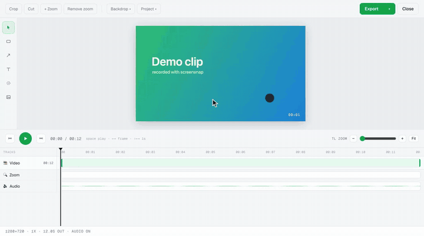

# screensnap.

### ▸ [Add to Chrome — free on the Chrome Web Store](https://chromewebstore.google.com/detail/screensnap/hadhpopgpoejimciiihfffdmiihffkcl)

[](https://chromewebstore.google.com/detail/screensnap/hadhpopgpoejimciiihfffdmiihffkcl)
[](https://chromewebstore.google.com/detail/screensnap/hadhpopgpoejimciiihfffdmiihffkcl)
[](https://chromewebstore.google.com/detail/screensnap/hadhpopgpoejimciiihfffdmiihffkcl)
[](LICENSE)

A free, local, watermark-free Chrome extension (Manifest V3) for screenshots and screen recording.
Built because being nagged to log in just to save a screenshot is miserable.

- **Free & unrestricted** — no paywalls, no watermarks, no sign-ups, no upsell.
- **Private & local** — every byte of capture, processing, and storage stays on your machine. No
  servers, no telemetry, no cloud, **no runtime network requests** (fonts are vendored, not fetched).
- **No dark patterns** — no forced new tab after recording, no mandatory cloud hosting. Capture →
  it lands in your Downloads. Done.



## Features

**Screenshots** (PNG)
- **Visible Tab** · **Full Page** (auto-scroll + stitch, de-dupes sticky headers) · **Select Area**
  (on-page green marquee with live dimensions, Enter to capture)
- After capture you get a **captured card**: **Annotate & save**, **Save PNG directly**, **Copy**, or Discard
- **Annotation editor** — Draw, Arrow, Rectangle, Text, Highlight, Blur/Redact, Eraser, **Crop**
  (free-form or 16:9 / 1:1 / 9:16 / 4:3), a **Layers panel** (select, reorder, show/hide, delete,
  **re-edit text**, add **image/logo layers**), a **Beautify backdrop** (gradient/solid + rounded
  corners + shadow), colours, stroke weights, undo/redo, copy-to-clipboard

**Screen recording** → **native `.mp4`**
- **Current Tab** — instant, no picker; a Loom-style control bar sits on the page (auto-hidden during capture)
- **Screen / Window** — Chrome's **native picker** (`getDisplayMedia`, run inside the offscreen document):
  record a whole monitor or any app window, even outside Chrome
- **Screen + Cam** — the picker plus your **webcam composited as a corner bubble** (circle/square, size,
  corner, mirror — all adjustable live), drawn onto a canvas in the offscreen document and recorded as one MP4
- Screen / Screen+Cam are controlled from the toolbar **REC** badge, the popup, and keyboard shortcuts
  (no on-page bar off-tab, and no countdown — the picker is the "get ready" beat)
- **System / tab audio** and/or **microphone** (mixed), **pause / resume**, and a red **REC** badge

**Video editor** (opens after a recording; WebCodecs, no ffmpeg/WASM)
- A **multi-track timeline** — pinned ruler + video track, then a track per overlay, plus audio —
  with drag-to-move / drag-edge-to-resize clips, **snapping** (playhead, clip edges, whole seconds),
  timeline zoom, and a constant-height panel (adding tracks never reflows the stage)
- **Trim** the ends and **cut** mistakes out of the middle (multi-segment), **resolution** and **speed**
- **Crop** free-form or to a ratio (16:9 / 1:1 / 9:16 / 4:3); **Zoom** with draggable, resizable focus
  blocks that ease in/out; **Beautify backdrop** (gradient/solid + rounded corners + shadow)
- **Layers** — annotations (text, arrows, shapes, blur), **image/logo** overlays, and **animated GIF**
  overlays — all **resizable** on the stage (8-handle selection box) and **time-scoped** on the
  timeline (e.g. an arrow that appears for 3 seconds), composited live (WYSIWYG preview = export)
- **Audio editing** — waveform view, drag to **mute regions** (without cutting the video), volume /
  mute, and **import a voiceover or music track** (movable, trimmable, mixed into the export)
- A left **tool rail** with keyboard shortcuts (V R A T B I), draw-once tools that return to Select,
  ⌘D duplicate, frame-step keys, and prev/next-edit transport buttons
- **Export** a native **MP4** (bitrate scales with resolution, so 720p/1080p genuinely shrink files)
  or an animated **GIF** — or download the original clip untouched

**Google Drive backup** (optional, off by default)
- Connect **your own Google Drive** in the popup and screensnap can **auto-upload finished
  recordings** to a private "screensnap" folder — or upload one-off from the done card / the
  editor's export menu
- **Share a recording with a link.** From the done card or the editor, screensnap marks that clip
  "anyone with the link" and hands you a branded share page at **screensnap.xyz/v/** that plays it back.
  Sharing is per-recording and opt-in, so your other recordings stay private.
- Direct browser-to-Google only (narrow `drive.file` scope: screensnap can only see files it
  created). **No screensnap servers, no proxy, no account with us** — disconnect revokes access.
  Until you connect it, the extension makes no network requests at all.

## MP4, natively — no transcoding

`MediaRecorder` records **H.264 MP4 directly** on modern Chrome, so there's **no ffmpeg, no WASM, no
conversion step** — the recording is saved the instant you stop. (On the rare build without native
MP4 support it saves `.webm` rather than lose your recording.)

## Install

**Most people:** [add it from the Chrome Web Store](https://chromewebstore.google.com/detail/screensnap/hadhpopgpoejimciiihfffdmiihffkcl) — one click, no sign-up.

**From source (for development):**

```
chrome://extensions  →  enable Developer mode  →  Load unpacked  →  select this folder
```

That's it — **no build step, no `npm install`, zero dependencies.** Icons and fonts are committed, so
it runs straight from source. (`npm run make:icons` only re-generates the placeholder icons.)

## Architecture

No framework, no bundler, zero runtime dependencies — plain ES modules + self-contained injected
overlays.

| Piece | File(s) | Role |
| --- | --- | --- |
| **Service worker** | `src/background/service-worker.js` | Orchestrates everything: screenshots (`captureVisibleTab` + injected scroll/crop helpers stitched with `OffscreenCanvas`), the recording lifecycle, downloads, badge, and persisted state. |
| **Popup** | `src/popup/` | The screensnap UI — capture/record tabs, captured card, recording / saving / done. UI + dispatch only. |
| **Offscreen document** | `src/offscreen/` | Hosts `MediaRecorder` (a service worker has no DOM; the popup closes on blur). Opens the screen picker (`getDisplayMedia`), and for Screen + Cam composites the screen + webcam bubble onto a canvas (driven by `draw-worker.js`). Saves native MP4. |
| **On-page overlays** | `src/content/` | Injected via `executeScript`: `editor-overlay` (annotation editor), `recorder-control` (the recording control bar: countdown → timer + pause + discard + stop) and `draw-overlay` (auto-fading pen). Re-injected on navigation so controls survive reloads / navigation. The Screen + Cam webcam is **not** an overlay — it's composited into the video in the offscreen document (`draw-worker.js` metronome + canvas), so it works over any screen/window. |

`chrome.tabCapture` records the **entire tab**, and there is no API to exclude an on-page element — so a *visible*
control would appear in the video. Like Loom, the control bar copies that constraint instead of fighting it: it's
bottom-left and **collapsed / auto-hidden during recording** (move the pointer to the bottom-left corner to reveal
it), and global shortcuts (`commands`: stop `Alt+Shift+S`, pause `Alt+Shift+P`) + the toolbar REC badge stop/pause it
while hidden — so the recording stays clean. (Screen / Screen+Cam capture at the OS level via `getDisplayMedia`, so
their controls are the badge / popup / shortcuts; the on-page bar there is a best-effort extra on the active tab.)
Surviving a jump to a **different site** mid-recording needs the optional `<all_urls>` host permission, which the
popup requests with the user's click when a Current Tab recording starts. The captured media stream keeps running
across navigations regardless.

State lives in `chrome.storage.session` so it survives the service worker being torn down
mid-recording. The popup, recorder window, and overlays all reflect it live via `STATE_CHANGED`.

## Permissions (deliberately minimal)

`activeTab` + `scripting` (only the tab you invoked it on — **no `<all_urls>`, no history scope**),
`tabCapture` (record the current tab), `offscreen`, `downloads`, `storage`. Whole-screen / window capture
uses the standard **`getDisplayMedia()`** Web API from the offscreen document — it needs **no extra
permission** and shows nothing until you start a Screen / Window recording and pick a source (no background
screen access). Screen + Cam additionally uses your webcam via standard `getUserMedia` (one-time browser
prompt) — also no manifest permission. For the optional Google Drive backup, `identity` ships in the
manifest (it is warning-free and inert until you connect — Chrome can't reliably expose a
runtime-granted API to a running service worker, so it can't be optional), while `googleapis.com`
host access **is** optional and requested only when you click Connect.

## Known limitations

- **Full-page capture** uses `captureVisibleTab` (rate-limited ~2/sec), so long pages take a few
  seconds; lazy-loaded content and complex sticky layouts can still leave seams.
- **Screen + Cam** composites the webcam as a fixed corner bubble (pick corner/size/shape/mirror in the
  popup, adjustable mid-recording) — it isn't a freely-draggable live overlay, because off-tab screen
  capture has no web page to overlay.
- **Screen / Window** capture has no on-page overlays when you're off the active browser tab (the camera
  bubble and pen live in a web page), and on **macOS** system audio isn't captured (no OS loopback) —
  the mic still records. The native picker / OS prompt governs screen access.
- Internal pages (`chrome://`, the Web Store, etc.) can't be captured **as a tab** — Chrome blocks it.
  (You can still capture them via **Screen / Window**, which records at the OS level.)

## Fonts

UI type is [Geist / Geist Mono](https://github.com/vercel/geist-font) (SIL OFL 1.1), vendored as
`.woff2` under `src/popup/fonts/` so nothing is fetched at runtime.

## Project conventions

See [CLAUDE.md](CLAUDE.md) — trunk-based commits to `main`, zero runtime dependencies, and the
privacy/free principles above are non-negotiable.

## License

GNU GPL v3.0 (or later) — see [LICENSE](LICENSE).
